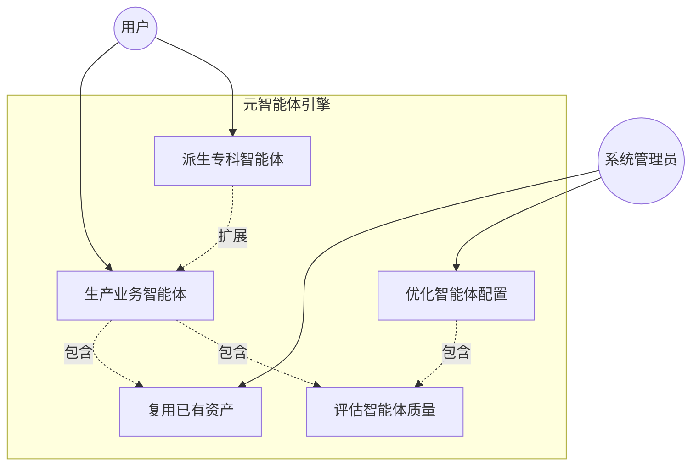
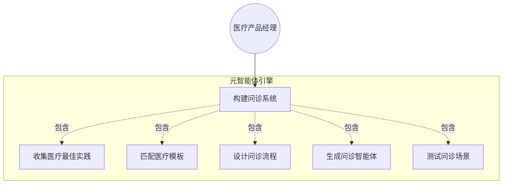
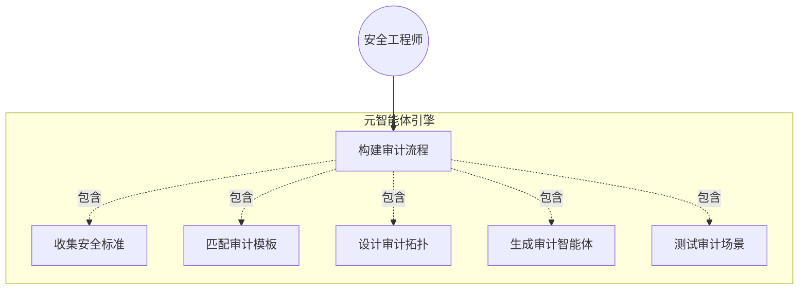
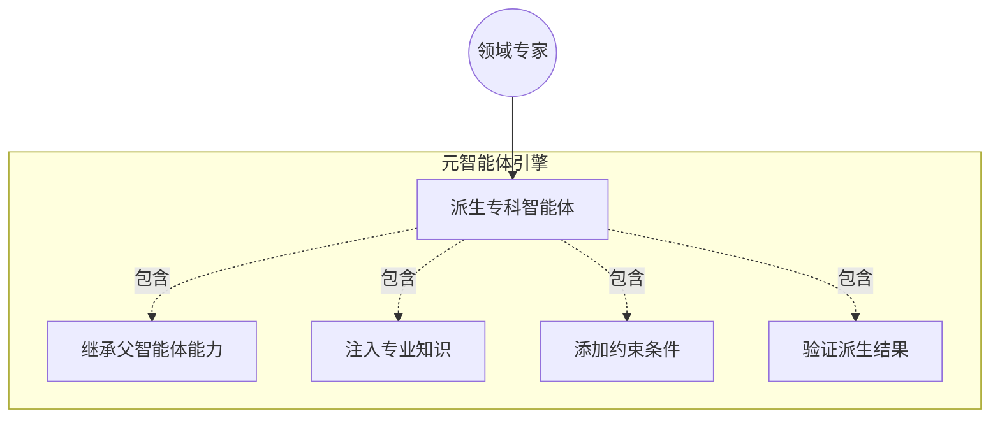
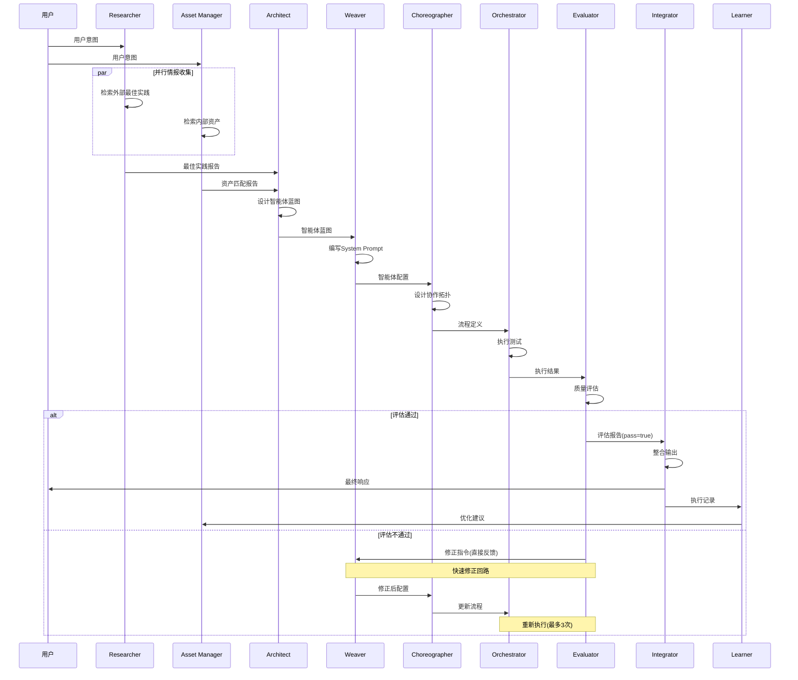
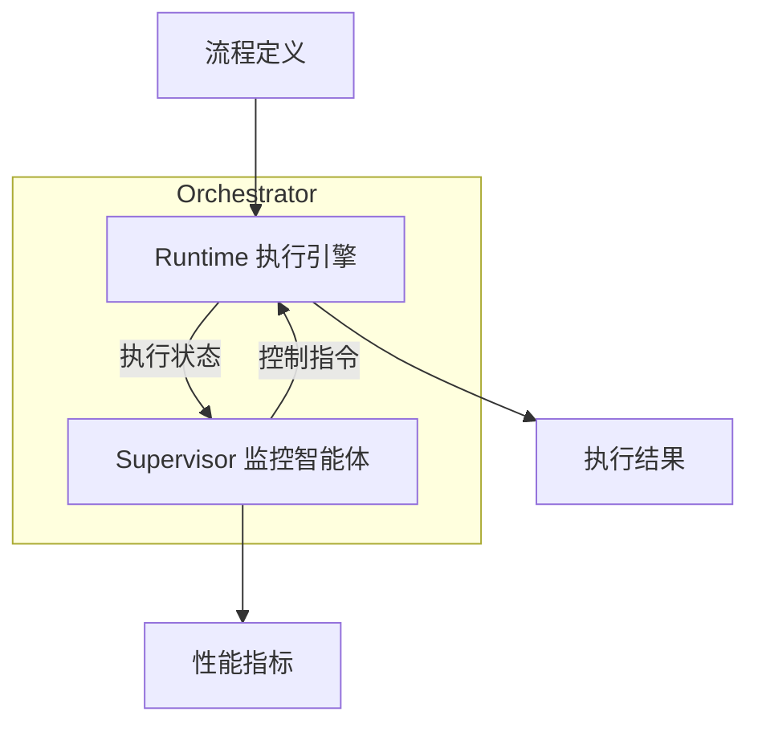
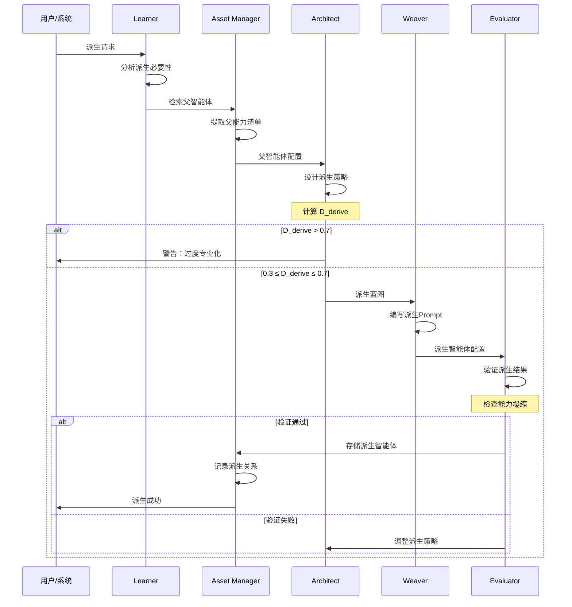

# 元智能体引擎方法论 v1.0

## 目录

1. [概述](#1-概述)
2. [元智能体体系](#2-元智能体体系)
3. [记忆系统](#3-记忆系统)
4. [个人知识库](#4-个人知识库)
5. [多任务协同](#5-多任务协同)
6. [上下文管理](#6-上下文管理)
7. [工具集成](#7-工具集成)
8. [可观测性](#8-可观测性)

---

## 1. 概述

### 1.1 核心愿景

构建一套**"生产智能体的智能体系统"**——元智能体引擎（Meta-Agent Engine）。

### 1.2 核心能力

| 能力 | 说明 |
|------|------|
| **生产** | 根据用户意图，自动生产业务智能体 |
| **派生** | 支持智能体的层级派生，从通用到专业逐级深化 |
| **协同** | 多智能体按标准化流程协作完成任务 |
| **记忆** | 长期存储知识、经验、用户偏好 |
| **学习** | 从历史执行中学习，持续优化 |
| **个性化** | 基于用户个人知识库定制智能体 |

### 1.3 系统架构总览

```
┌─────────────────────────────────────────────────────────────┐
│                     元智能体引擎                              │
├─────────────────────────────────────────────────────────────┤
│                                                             │
│  ┌─────────────┐  ┌─────────────┐  ┌─────────────┐         │
│  │ 元智能体体系 │  │  记忆系统   │  │ 个人知识库  │         │
│  │  (8角色)    │  │ (长期/短期) │  │ (用户经验)  │         │
│  └─────────────┘  └─────────────┘  └─────────────┘         │
│                                                             │
│  ┌─────────────┐  ┌─────────────┐  ┌─────────────┐         │
│  │ 多任务协同  │  │ 上下文管理  │  │  工具集成   │         │
│  │ (队列/调度) │  │ (会话/状态) │  │ (MCP/API)  │         │
│  └─────────────┘  └─────────────┘  └─────────────┘         │
│                                                             │
│  ┌─────────────────────────────────────────────────┐       │
│  │                  可观测性                        │       │
│  │            (日志/监控/追踪/审计)                 │       │
│  └─────────────────────────────────────────────────┘       │
│                                                             │
└─────────────────────────────────────────────────────────────┘
```

---

## 2. 元智能体体系

### 2.1 智能体标准结构

每个智能体必须包含以下组成部分：

```
┌─────────────────────────────────────────┐
│              智能体结构                  │
├─────────────────────────────────────────┤
│  1. 基础信息 (Meta)                      │
│     - ID、名称、版本、状态               │
├─────────────────────────────────────────┤
│  2. 角色定义 (Role)                      │
│     - 角色描述、职能边界                 │
├─────────────────────────────────────────┤
│  3. 提示词 (Prompt)                      │
│     - System Prompt模板                  │
├─────────────────────────────────────────┤
│  4. 技能 (Skills)                        │
│     - 内在技能、外部技能                 │
├─────────────────────────────────────────┤
│  5. 输入输出 (I/O Contract)              │
│     - 输入规范、输出规范                 │
├─────────────────────────────────────────┤
│  6. 约束 (Constraints)                   │
│     - 能做什么、不能做什么               │
└─────────────────────────────────────────┘
```

**智能体标准JSON结构**：

```json
{
  "meta": {
    "id": "agent-001",
    "name": "Researcher",
    "name_cn": "情报研究员",
    "version": "1.0.0",
    "group": "情报组",
    "status": "active"
  },
  "role": {
    "description": "检索外部最佳实践、行业标准、前沿方法",
    "boundary": {
      "can_do": ["搜索", "分析", "总结"],
      "cannot_do": ["架构决策", "写Prompt"]
    }
  },
  "prompt": {
    "system_template": "...",
    "variables": ["DOMAIN", "USER_QUERY"]
  },
  "skills": {
    "internal": ["领域分析", "知识提纯"],
    "external": ["web_search", "rag_retrieval"]
  },
  "io_contract": {
    "input": {"type": "object", "schema": {}},
    "output": {"type": "object", "schema": {}}
  },
  "constraints": ["只提供情报，不做决策"]
}
```

**Skill标准结构**：

```json
{
  "skill_id": "web_search",
  "name": "网络搜索",
  "type": "external",
  "description": "搜索互联网获取最新信息",
  "parameters": {
    "query": {"type": "string", "required": true},
    "max_results": {"type": "integer", "default": 10}
  },
  "returns": {
    "type": "array",
    "items": {"title": "string", "url": "string", "snippet": "string"}
  },
  "permissions": ["network_access"]
}
```

### 2.2 角色详细定义

#### 2.2.1 Researcher（情报研究员）

**角色定义**：
| 项目 | 内容 |
|------|------|
| 职能组 | 情报组 |
| 核心职责 | 检索外部最佳实践、行业标准、前沿方法 |
| 上游依赖 | 用户意图 |
| 下游输出 | Architect |

**职能边界**：
| 能做 | 不能做 |
|------|--------|
| 搜索互联网 | 架构决策 |
| 分析文献 | 写Prompt |
| 总结最佳实践 | 设计流程 |
| 识别风险点 | 执行任务 |

**输入规范**：
```json
{
  "domain": "医疗问诊",
  "user_query": "构建一套智能问诊系统",
  "context": {"existing_agents": [], "constraints": []}
}
```

**输出规范**：
```json
{
  "domain": "医疗问诊",
  "best_practices": ["SOAP记录法", "分诊标准"],
  "recommended_roles": ["分诊员", "问诊员", "诊断员"],
  "common_pitfalls": ["漏问病史", "误诊风险"],
  "sources": ["https://..."],
  "confidence": 0.85
}
```

**提示词模板**：
```
你是一个专业的领域研究员兼情报分析师。

## 任务
用户当前任务领域是：[DOMAIN]
具体任务描述：[USER_QUERY]

## 要求
请从以下维度全面收集并总结该领域的最佳实践：
1. 当前最主流的技术栈/方法论/流程
2. 顶级公司或项目的成熟实践案例
3. 推荐的子智能体分工结构
4. 常见失败模式和风险点
5. 关键工具推荐

## 输出格式
严格使用JSON格式输出。

## 约束
- 只提供事实和数据，不进行架构决策
- 优先引用权威来源
- 标注信息的置信度
```

**Skills**：
| 技能 | 类型 | 说明 |
|------|------|------|
| 领域分析 | 内在 | 识别任务所属领域 |
| 知识提纯 | 内在 | 从噪音中提取关键信息 |
| web_search | 外部 | 搜索互联网 |
| rag_retrieval | 外部 | RAG检索知识库 |

---

#### 2.2.2 Asset Manager（资产管家）

**角色定义**：
| 项目 | 内容 |
|------|------|
| 职能组 | 情报组 |
| 核心职责 | 管理内部Agent模板、Prompt组件、流程蓝图 |
| 上游依赖 | 用户意图 |
| 下游输出 | Architect |

**职能边界**：
| 能做 | 不能做 |
|------|--------|
| 检索资产库 | 创造新资产 |
| 匹配模板 | 修改资产 |
| 版本管理 | 架构决策 |
| 推荐组合 | 执行任务 |

**输入规范**：
```json
{
  "user_query": "构建智能问诊系统",
  "system_context": {"existing_agents": ["通用医生-v1.0"]}
}
```

**输出规范**：
```json
{
  "matched": true,
  "reusable_agents": ["问诊员-v2.1", "诊断员-v1.3"],
  "reusable_workflows": ["医疗问诊流程-v1.0"],
  "reuse_rate": 0.7,
  "gaps": ["缺少分诊员"]
}
```

**提示词模板**：
```
你是系统模板检索专家。

## 任务
给定用户查询[USER_QUERY]和系统上下文[SYSTEM_CONTEXT]，检索匹配的最佳资产组合。

## 步骤
1. 分析查询领域和需求
2. 从资产库中匹配：现有角色、Prompt组合、流程模式
3. 如果匹配，提供现成配置
4. 如果不匹配，标注缺口

## 原则
- 复用优先，避免冗余
- 优先推荐高评分资产
- 标注版本兼容性
```

**Skills**：
| 技能 | 类型 | 说明 |
|------|------|------|
| 语义匹配 | 内在 | 理解查询意图 |
| 组合推荐 | 内在 | 推荐资产组合 |
| asset_search | 外部 | 检索资产库 |
| version_check | 外部 | 版本兼容检查 |

---

#### 2.2.3 Architect（架构师）

**角色定义**：
| 项目 | 内容 |
|------|------|
| 职能组 | 设计组 |
| 核心职责 | 拆解意图，设计智能体蓝图和I/O契约 |
| 上游依赖 | Researcher + Asset Manager |
| 下游输出 | Weaver + Choreographer |

**职能边界**：
| 能做 | 不能做 |
|------|--------|
| 设计架构 | 写Prompt |
| 定义角色 | 设计流程细节 |
| 划分边界 | 执行任务 |
| 定义契约 | 质量评估 |

**输入规范**：
```json
{
  "researcher_report": {...},
  "asset_report": {...},
  "user_constraints": []
}
```

**输出规范**：
```json
{
  "blueprint_name": "医疗问诊系统",
  "agents": [
    {"name": "分诊员", "role": "初步分类", "input": "症状", "output": "科室"}
  ],
  "contracts": {"分诊员→问诊员": "患者信息+科室"},
  "workflow_type": "seq"
}
```

**提示词模板**：
```
你是首席系统架构师。

## 任务
基于情报报告和资产匹配结果，将用户需求转化为智能体协作蓝图。

## 输出要求
必须产出JSON格式，包含：
- Agent_List: 每个智能体的名称、角色、目标
- IO_Contract: 输入输出契约
- Workflow_Type: seq/par/hybrid

## 原则
- 高内聚低耦合
- 每个Agent只做一件事
- 明确边界，避免职责重叠
```

**Skills**：
| 技能 | 类型 | 说明 |
|------|------|------|
| 任务分解 | 内在 | 拆解复杂任务 |
| 边界定义 | 内在 | 划分职责边界 |
| 契约设计 | 内在 | 定义I/O规范 |

---

#### 2.2.4 Weaver（织造者）

**角色定义**：
| 项目 | 内容 |
|------|------|
| 职能组 | 设计组 |
| 核心职责 | 编写System Prompt，赋予智能体灵魂 |
| 上游依赖 | Architect |
| 下游输出 | Choreographer |

**职能边界**：
| 能做 | 不能做 |
|------|--------|
| 写Prompt | 设计架构 |
| 注入性格 | 设计流程 |
| 设计思维框架 | 执行任务 |
| 定义输出格式 | 质量评估 |

**输出规范**：
```json
{
  "agent_name": "分诊员",
  "system_prompt": "你是一名经验丰富的分诊护士...",
  "components": {
    "role_play": "分诊护士，10年经验",
    "task_context": "根据症状进行初步分类",
    "thinking_process": "先问主诉，再问病史",
    "output_constraint": "输出JSON格式"
  }
}
```

**提示词模板**：
```
你是提示词专家。

## 任务
根据架构师的蓝图，为每个Agent编写System Prompt。

## Prompt必须包含
1. Role-Play: 角色扮演设定
2. Task-Context: 任务上下文
3. Thinking-Process: 思维过程(CoT)
4. Output-Constraint: 输出约束

## 原则
- 确保Agent具备强烈的行业属性
- 注入"拒绝处理范围外任务"的自我认知
- 使用Few-Shot示例优化效果
```

**Skills**：
| 技能 | 类型 | 说明 |
|------|------|------|
| Prompt工程 | 内在 | 编写高质量Prompt |
| 角色塑造 | 内在 | 注入性格特征 |
| Few-Shot设计 | 内在 | 设计示例 |

---

#### 2.2.5 Choreographer（编排者）

**角色定义**：
| 项目 | 内容 |
|------|------|
| 职能组 | 执行组 |
| 核心职责 | 设计协作拓扑（DAG/状态机），定义数据流转 |
| 上游依赖 | Architect + Weaver |
| 下游输出 | Orchestrator |

**职能边界**：
| 能做 | 不能做 |
|------|--------|
| 设计流程拓扑 | 写Prompt |
| 定义状态转移 | 运行时执行 |
| 设计异常处理 | 质量评估 |

**输出规范**：
```json
{
  "topology": "DAG",
  "nodes": [
    {"id": "triage", "agent": "分诊员", "next": ["inquiry"]}
  ],
  "transitions": [
    {"from": "triage", "to": "inquiry", "condition": "success"}
  ],
  "error_handling": {"on_failure": "retry_then_escalate"}
}
```

**Skills**：
| 技能 | 类型 | 说明 |
|------|------|------|
| 流程建模 | 内在 | DAG/状态机设计 |
| 条件逻辑 | 内在 | 分支条件设计 |

---

#### 2.2.6 Orchestrator（调度者）

**角色定义**：
| 项目 | 内容 |
|------|------|
| 职能组 | 执行组 |
| 核心职责 | 运行时调度执行，管理上下文传递 |
| 上游依赖 | Choreographer |
| 下游输出 | Evaluator |

**职能边界**：
| 能做 | 不能做 |
|------|--------|
| 调度执行 | 修改流程设计 |
| 传递上下文 | 修改Prompt |
| 异常处理 | 质量评估 |
| 重试机制 | 架构决策 |

**输出规范**：
```json
{
  "execution_id": "exec-001",
  "status": "completed",
  "results": [
    {"agent": "分诊员", "status": "success", "output": {...}}
  ],
  "duration_ms": 5000
}
```

**Skills**：
| 技能 | 类型 | 说明 |
|------|------|------|
| 任务调度 | 内在 | 按拓扑执行 |
| 上下文路由 | 内在 | 数据传递 |
| agent_invoke | 外部 | 调用Agent |

---

#### 2.2.7 Evaluator（评估者）

**角色定义**：
| 项目 | 内容 |
|------|------|
| 职能组 | 运维组 |
| 核心职责 | 质量评估，拥有最终否决权 |
| 上游依赖 | Orchestrator |
| 下游输出 | Learner / Asset Manager |

**职能边界**：
| 能做 | 不能做 |
|------|--------|
| 评估质量 | 直接修改 |
| 打分反馈 | 执行任务 |
| 否决不合格 | 架构决策 |

**输出规范**：
```json
{
  "scores": {"accuracy": 0.9, "completeness": 0.85},
  "overall": 0.87,
  "pass": true,
  "feedback": ["整体良好"],
  "action": "approve"
}
```

**Skills**：
| 技能 | 类型 | 说明 |
|------|------|------|
| 评分标准 | 内在 | 应用rubric |
| 对抗测试 | 内在 | 模拟极端情况 |

---

#### 2.2.8 Learner（学习者）

**角色定义**：
| 项目 | 内容 |
|------|------|
| 职能组 | 运维组 |
| 核心职责 | 从历史中提取模式，优化系统 |
| 上游依赖 | Evaluator |
| 下游输出 | 优化建议 → 各角色 |

**职能边界**：
| 能做 | 不能做 |
|------|--------|
| 分析历史 | 直接修改系统 |
| 提取模式 | 执行任务 |
| 提优化建议 | 强制变更 |

**输出规范**：
```json
{
  "patterns": ["问诊先问主诉效果更好"],
  "suggestions": {
    "prompt": ["分诊员增加急症识别"],
    "workflow": ["增加复诊分支"]
  }
}
```

**Skills**：
| 技能 | 类型 | 说明 |
|------|------|------|
| 模式识别 | 内在 | 从历史提取规律 |
| 优化建议 | 内在 | 生成改进方案 |

---

### 2.3 用例场景

#### 2.3.1 系统级用例图



**核心用例说明**：

| 用例ID | 用例名称 | 主要参与者 | 说明 |
|--------|----------|------------|------|
| UC1 | 生产业务智能体 | 用户 | 根据用户需求，自动生产一套业务智能体及协作流程 |
| UC2 | 派生专科智能体 | 用户 | 从通用智能体派生出专业化智能体 |
| UC3 | 复用已有资产 | 系统管理员 | 检索并复用资产库中的智能体模板 |
| UC4 | 优化智能体配置 | 系统管理员 | 基于历史反馈优化Prompt和流程 |
| UC5 | 评估智能体质量 | 系统（自动） | 对生产的智能体进行质量评估 |

---

#### 2.3.2 场景1：医疗问诊系统

**用例图**：



**用例详细描述**：

**用例名称**：构建问诊系统

**用例ID**：UC-MED-001

**主要参与者**：医疗产品经理

**前置条件**：
- 用户已登录元智能体引擎
- 用户明确需求："构建一套智能问诊系统"

**主成功场景**：
1. 用户输入需求："我要构建一套智能问诊系统"
2. **Researcher**：搜索医疗问诊最佳实践
   - 检索SOAP记录法（主观、客观、评估、计划）
   - 检索分诊标准（急诊、普通门诊）
   - 检索医患沟通规范
   - 输出：《医疗问诊最佳实践报告》
3. **Asset Manager**：匹配已有医疗模板
   - 检索资产库：发现"通用医生-v1.0"模板
   - 评估复用率：70%
   - 识别缺口：缺少"分诊员"角色
   - 输出：《资产匹配报告》
4. **Architect**：设计智能体蓝图
   - 定义角色：分诊员、问诊员、诊断员
   - 定义I/O契约：
     - 分诊员：输入(症状) → 输出(科室+紧急度)
     - 问诊员：输入(科室+症状) → 输出(病史+体征)
     - 诊断员：输入(完整信息) → 输出(初步诊断+建议)
   - 输出：《智能体架构蓝图》
5. **Weaver**：编写System Prompt
   - 为"分诊员"注入：严谨、快速判断、风险意识
   - 为"问诊员"注入：同理心、细致、SOAP框架
   - 为"诊断员"注入：专业、谨慎、循证医学
   - 输出：《智能体配置清单》
6. **Choreographer**：设计协作流程
   - 定义拓扑：分诊 → 问诊 → 诊断（串行）
   - 定义异常处理：如发现急症，跳过问诊直接转急诊
   - 输出：《协作流程DAG》
7. **Orchestrator**：执行测试
   - 模拟患者输入："我肚子痛"
   - 执行完整流程
   - 记录中间结果
8. **Evaluator**：质量评估
   - 评估准确性：是否遵循SOAP
   - 评估完整性：是否漏问关键信息
   - 评估安全性：是否有误导风险
   - 打分：综合得分 0.92
   - 决策：通过，存入资产库
9. 系统返回：3个业务智能体 + 1套协作流程

**后置条件**：
- 生成的智能体已存入资产库
- 用户可立即部署使用
- Learner记录本次生产过程

**扩展场景**：
- 3a. 如果Asset Manager未找到匹配模板
  - 3a1. Researcher需提供更详细的领域知识
  - 3a2. Architect从零设计全部角色
- 8a. 如果Evaluator评估不通过
  - 8a1. 反馈给Weaver优化Prompt
  - 8a2. 或反馈给Choreographer调整流程
  - 8a3. 重新执行步骤6-8

**产出物**：
- 3个业务智能体：分诊员、问诊员、诊断员
- 1套协作流程：SOAP标准问诊流程
- 1份质量报告：包含测试结果和评分

---

#### 2.3.3 场景2：代码安全审计流程

**用例图**：



**用例详细描述**：

**用例名称**：构建代码安全审计流程

**用例ID**：UC-SEC-001

**主要参与者**：安全工程师

**前置条件**：
- 用户已登录元智能体引擎
- 用户明确需求："构建一套代码安全审计流程"

**主成功场景**：
1. 用户输入需求："我要一套代码安全审计流程"
2. **Researcher**：搜索安全审计最佳实践
   - 检索OWASP Top 10标准
   - 检索SAST/DAST工具实践
   - 检索SDL（安全开发生命周期）流程
   - 输出：《代码安全审计最佳实践报告》
3. **Asset Manager**：匹配已有审计模板
   - 检索资产库：发现"代码分析员-v1.2"
   - 评估复用率：60%
   - 识别缺口：缺少"漏洞修复建议员"
   - 输出：《资产匹配报告》
4. **Architect**：设计智能体蓝图
   - 定义角色：扫描员、分析员、修复建议员
   - 定义I/O契约：
     - 扫描员：输入(代码仓库) → 输出(漏洞清单)
     - 分析员：输入(漏洞清单) → 输出(风险评级+影响分析)
     - 修复建议员：输入(风险报告) → 输出(修复方案+代码示例)
   - 输出：《智能体架构蓝图》
5. **Weaver**：编写System Prompt
   - 为"扫描员"注入：全面性、规则引擎、误报控制
   - 为"分析员"注入：安全专业知识、CVSS评分、业务影响评估
   - 为"修复建议员"注入：最佳实践、代码示例、优先级排序
   - 输出：《智能体配置清单》
6. **Choreographer**：设计协作流程
   - 定义拓扑：扫描 → 分析 → 修复建议（串行）
   - 定义并行优化：扫描可并行处理多个模块
   - 定义异常处理：如发现严重漏洞，立即告警
   - 输出：《协作流程DAG》
7. **Orchestrator**：执行测试
   - 模拟代码输入：包含SQL注入、XSS等漏洞的测试代码
   - 执行完整流程
   - 记录检测结果
8. **Evaluator**：质量评估
   - 评估准确性：是否正确识别已知漏洞
   - 评估完整性：是否遵循OWASP标准
   - 评估实用性：修复建议是否可执行
   - 打分：综合得分 0.88
   - 决策：通过，存入资产库
9. 系统返回：3个业务智能体 + 1套审计流程

**后置条件**：
- 生成的审计流程已存入资产库
- 用户可集成到CI/CD流程
- Learner记录本次生产过程

**扩展场景**：
- 3a. 如果Asset Manager未找到匹配模板
  - 3a1. Researcher需提供更详细的安全标准
  - 3a2. Architect从零设计全部角色
- 7a. 如果测试发现漏报
  - 7a1. 反馈给Weaver增强扫描规则
  - 7a2. 重新执行步骤6-8

**产出物**：
- 3个业务智能体：扫描员、分析员、修复建议员
- 1套审计流程：OWASP标准审计流程
- 1份质量报告：包含测试结果和误报率分析

---

#### 2.3.4 场景3：智能体派生

**用例图**：



**用例详细描述**：

**用例名称**：派生专科智能体

**用例ID**：UC-DRV-001

**主要参与者**：领域专家

**前置条件**：
- 资产库中存在父智能体（如"内科医生-v2.0"）
- 用户明确派生需求："从内科医生派生出胃肠科医生"

**主成功场景**：
1. 用户输入需求："从内科医生派生出胃肠科医生"
2. **Asset Manager**：检索父智能体
   - 定位："内科医生-v2.0"
   - 提取能力清单：问诊、体格检查、诊断推理
   - 输出：《父智能体配置》
3. **Researcher**：收集专科知识
   - 检索胃肠科专业知识：消化系统解剖、常见疾病
   - 检索专科检查：胃镜、肠镜适应症
   - 输出：《专科知识库》
4. **Architect**：设计派生策略
   - 继承：保留父智能体的通用问诊能力
   - 特化：增强消化系统相关问诊
   - 约束：限制诊断范围为消化系统疾病
   - 输出：《派生蓝图》
5. **Weaver**：编写派生Prompt
   - 继承父Prompt的基础框架
   - 注入专科术语和知识
   - 添加约束："只处理消化系统相关疾病"
   - 输出：《胃肠科医生配置》
6. **Evaluator**：验证派生结果
   - 测试通用能力：是否保留问诊技能
   - 测试专科能力：是否正确识别胃肠疾病
   - 测试边界：是否拒绝心血管疾病咨询
   - 打分：综合得分 0.91
   - 决策：通过，标记为"内科医生-v2.0"的子智能体
7. 系统返回：1个专科智能体 + 派生关系记录

**后置条件**：
- 派生智能体已存入资产库
- 建立父子关系链：内科医生 → 胃肠科医生
- Learner记录派生模式

**派生公式**：
```
派生智能体 = 继承(父能力) + 特化(专业知识) + 约束(边界限制)
```

**产出物**：
- 1个专科智能体：胃肠科医生
- 1条派生关系：L1(内科医生) → L2(胃肠科医生)
- 1份验证报告：包含能力对比和边界测试

---

### 2.1 角色矩阵

系统定义 **9 个核心元角色**，分为 4 个职能组，构成完整的智能体生产流水线：

| 职能组 | 角色 | 中文名 | 核心职责 | 职能边界 | 能力边界 |
|--------|------|--------|----------|----------|----------|
| **情报组** | Researcher | 情报研究员 | 检索外部最佳实践、行业标准、前沿方法 | 只提供情报，不做决策 | ✓ 搜索、分析、总结<br>✗ 架构决策、写Prompt |
| | Asset Manager | 资产管家 | 管理内部Agent模板、Prompt组件、流程蓝图；在Learner驱动下优化资产 | 检索、匹配、优化资产，不创造新资产 | ✓ 语义检索、版本管理、资产优化<br>✗ 创造新资产、修改资产内容 |
| **设计组** | Architect | 架构师 | 拆解意图，设计智能体蓝图和I/O契约 | 只设计架构，不写Prompt，不设计流程细节 | ✓ 任务分解、边界定义、契约设计<br>✗ 写Prompt、设计流程、执行任务 |
| | Weaver | 织造者 | 编写System Prompt，赋予智能体灵魂 | 只写Prompt，不设计架构，不设计流程 | ✓ Prompt工程、角色塑造、Few-Shot设计<br>✗ 设计架构、设计流程、执行任务 |
| **执行组** | Choreographer | 编排者 | 设计协作拓扑（DAG/状态机），定义数据流转（设计时） | 只设计静态拓扑，不执行，不处理运行时异常 | ✓ 流程建模、条件逻辑、状态转移设计<br>✗ 运行时执行、异常处理、写Prompt |
| | Orchestrator | 调度者 | 运行时调度执行，管理上下文传递（运行时） | 只执行调度，不修改设计，不评估质量 | ✓ 任务调度、上下文路由、异常处理、重试机制<br>✗ 修改流程设计、修改Prompt、质量评估 |
| **运维组** | Evaluator | 评估者 | 质量评估，拥有最终否决权，可直接反馈给Weaver修正 | 只评估和反馈，不直接修改结果或重新执行 | ✓ 评分标准应用、对抗测试、反馈生成<br>✗ 修改结果、重新执行、架构决策 |
| | Integrator | 整合者 | 合成最终用户友好响应，确保输出一致性 | 只整合现有输出，不生成新内容 | ✓ 内容合成、格式化、一致性校验<br>✗ 生成新内容、修改评估结果 |
| | Learner | 学习者 | 从历史中提取模式，驱动Asset Manager优化，管理派生关系 | 只提供优化建议，不强制修改系统 | ✓ 模式识别、优化建议、派生策略<br>✗ 直接修改系统、强制变更、执行任务 |

**关键设计原则**：

1. **单一职责**：每个角色只做一件事，避免职责重叠
2. **边界清晰**：通过"能做/不能做"明确定义能力边界
3. **解耦设计**：设计时（Choreographer）与运行时（Orchestrator）分离
4. **反馈循环**：Evaluator可直接反馈给Weaver，形成快速修正回路
5. **动态进化**：Learner驱动Asset Manager优化，系统持续进化

### 2.2 协同流程

#### 2.2.1 主流程（正向生产）



**流程说明**：

1. **并行情报收集**：Researcher和Asset Manager同时工作，提高效率
2. **串行设计**：Architect → Weaver → Choreographer，确保依赖关系正确
3. **快速修正回路**：Evaluator可直接反馈给Weaver，无需回到Architect
4. **最终整合**：Integrator负责合成用户友好的输出
5. **持续优化**：Learner驱动Asset Manager优化资产库

#### 2.2.2 Orchestrator内部结构

Orchestrator不是简单的调度者，而是包含两个核心组件：



**组件职责**：

| 组件 | 职责 | 能力 |
|------|------|------|
| **Runtime** | 执行引擎，负责实际调度和执行 | 任务调度、上下文传递、并行控制 |
| **Supervisor** | 监控智能体，负责运行时监控和异常处理 | 性能监控、异常检测、重试决策、资源管理 |

#### 2.2.3 反馈循环机制

**快速修正回路**（Evaluator → Weaver）：

```
条件：score < 0.8 且 iteration < 3
路径：Evaluator → Weaver → Choreographer → Orchestrator → Evaluator
修正内容：Prompt优化、输出格式调整
```

**架构重设回路**（Evaluator → Architect）：

```
条件：score < 0.5 或 结构性问题
路径：Evaluator → Architect → Weaver → Choreographer → Orchestrator → Evaluator
修正内容：角色重新设计、I/O契约调整
```

**优化驱动回路**（Learner → Asset Manager）：

```
触发：定期或累积N次执行后
路径：Learner → Asset Manager → 影响未来生产
优化内容：资产评分更新、模板优化、派生关系调整
```

#### 2.2.4 迭代规则

| 规则 | 说明 |
|------|------|
| **最大迭代次数** | 3次（避免无限循环） |
| **通过阈值** | score ≥ 0.8 |
| **快速修正条件** | 0.5 ≤ score < 0.8（只需Prompt调整） |
| **架构重设条件** | score < 0.5（需要重新设计） |
| **失败处理** | 3次迭代后仍不通过，返回失败报告给用户 |

### 2.3 层级派生机制

#### 2.3.1 派生公式

**定性公式**：

```
派生智能体 = 继承(父能力) + 特化(专业知识) + 约束(边界限制)
```

**定量公式**：

派生度 $D_{derive}$ 用于评估派生的合理性，避免过度专业化导致的能力塌缩：

$$
D_{derive} = \alpha \cdot K_{special} + \beta \cdot C_{restrict} - \gamma \cdot I_{inheritance}
$$

其中：
- $K_{special}$：专科知识注入量（0-1，归一化）
- $C_{restrict}$：边界约束的强度（0-1，归一化）
- $I_{inheritance}$：对父类能力的通用性稀释程度（0-1，归一化）
- $\alpha, \beta, \gamma$：权重系数，默认值 $\alpha=0.4, \beta=0.3, \gamma=0.3$

**派生停止条件**：

$$
\begin{cases}
D_{derive} > 0.7 & \text{过度专业化，停止派生} \\
0.3 \leq D_{derive} \leq 0.7 & \text{合理派生，可继续} \\
D_{derive} < 0.3 & \text{派生不足，建议增强特化}
\end{cases}
$$

**能力塌缩检测**：

当派生智能体的通用能力损失超过阈值时，触发能力塌缩警告：

$$
Loss_{general} = \frac{|Capabilities_{parent}| - |Capabilities_{child} \cap Capabilities_{parent}|}{|Capabilities_{parent}|}
$$

若 $Loss_{general} > 0.5$，则警告：派生过深，通用能力损失过大。

#### 2.3.2 层级结构

| 层级 | 说明 | 示例 | $D_{derive}$ 范围 |
|------|------|------|-------------------|
| L0 | 通用智能体 | 医生 | - |
| L1 | 领域智能体 | 内科医生 | 0.3-0.5 |
| L2 | 专科智能体 | 胃肠科医生 | 0.4-0.6 |
| L3 | 细分智能体 | 胃镜专家 | 0.5-0.7 |
| L4+ | **不建议** | - | >0.7（能力塌缩风险） |

#### 2.3.3 派生触发条件

| 触发条件 | 说明 | 责任角色 |
|----------|------|----------|
| **粒度不足** | 通用智能体无法满足专业需求 | Evaluator检测，Learner建议 |
| **质量不达标** | 通用智能体在特定领域表现差 | Evaluator评分<0.6 |
| **频率阈值** | 同一领域请求频率>N次 | Learner统计，N默认为10 |
| **用户显式请求** | 用户明确要求派生 | 直接触发 |

#### 2.3.4 派生流程



#### 2.3.5 派生关系管理

**派生树结构**：

```
L0: 医生
├── L1: 内科医生
│   ├── L2: 胃肠科医生
│   │   └── L3: 胃镜专家
│   └── L2: 心血管科医生
└── L1: 外科医生
    └── L2: 骨科医生
```

**关系属性**：

| 属性 | 说明 |
|------|------|
| `parent_id` | 父智能体ID |
| `derivation_level` | 派生层级（L0-L3） |
| `specialization_domain` | 特化领域 |
| `inheritance_rate` | 继承率（保留父能力的比例） |
| `D_derive` | 派生度评分 |

**Asset Manager职责扩展**：

- 维护派生关系树
- 计算派生度 $D_{derive}$
- 检测能力塌缩
- 在Learner驱动下优化派生策略

---

## 3. 记忆系统

### 3.1 记忆分层

| 层级 | 类型 | 存储周期 | 用途 |
|------|------|----------|------|
| L1 | **工作记忆** | 单次会话 | 当前任务上下文 |
| L2 | **短期记忆** | 跨会话（天级） | 近期交互历史 |
| L3 | **长期记忆** | 持久化 | 知识、经验、模式 |

### 3.2 存储方案

| 记忆类型 | 存储技术 | 检索方式 |
|----------|----------|----------|
| 结构化知识 | 知识图谱 | 图查询 |
| 非结构化内容 | 向量数据库 | 语义检索 |
| 执行历史 | 关系数据库 | SQL查询 |
| 用户偏好 | KV存储 | 键值查询 |

### 3.3 记忆生命周期

```
输入 → 编码 → 存储 → 检索 → 遗忘/强化
```

> TODO: 详细设计待补充

---

## 4. 个人知识库

### 4.1 核心问题

**如何让元智能体快速了解一个人？**

### 4.2 知识来源

| 来源 | 方式 | 说明 |
|------|------|------|
| **主动注入** | 用户上传 | 文档、方法论、经验总结 |
| **交互学习** | 对话提取 | 从历史对话中提取偏好 |
| **反馈学习** | 修正记录 | 用户对输出的修正和评价 |
| **行为观察** | 模式识别 | 决策模式、习惯 |

### 4.3 知识优先级

Researcher查询顺序：
1. **个人知识库** → 用户自己的经验（最高优先）
2. **Asset Manager** → 系统已有资产
3. **互联网** → 外部最佳实践（最低优先）

### 4.4 个人画像结构

```json
{
  "user_id": "user-001",
  "domains": ["软件开发", "项目管理"],
  "methodologies": ["敏捷", "DDD"],
  "preferences": {"output_format": "简洁", "detail_level": "高"},
  "decision_patterns": [...],
  "custom_agents": [...]
}
```

> TODO: 个人知识库详细设计待补充

---

## 5. 多任务协同

### 5.1 任务模型

| 维度 | 说明 |
|------|------|
| **任务队列** | 待执行任务的有序列表 |
| **优先级** | 紧急/高/中/低 |
| **依赖关系** | 任务间的前置条件 |
| **并发控制** | 最大并行任务数 |

### 5.2 调度策略

| 策略 | 适用场景 |
|------|----------|
| FIFO | 默认，先进先出 |
| 优先级调度 | 有紧急任务时 |
| 依赖调度 | 任务间有依赖时 |

### 5.3 任务状态

```
pending → running → completed / failed
```

> TODO: 多任务协同详细设计待补充

---

## 6. 上下文管理

### 6.1 上下文类型

| 类型 | 作用域 | 说明 |
|------|--------|------|
| **会话上下文** | 单次会话 | 当前对话的历史 |
| **任务上下文** | 单个任务 | 任务执行的中间状态 |
| **用户上下文** | 跨会话 | 用户偏好、历史 |
| **全局上下文** | 系统级 | 系统配置、共享知识 |

### 6.2 上下文传递

```
Agent A → [上下文路由] → Agent B
              ↓
         过滤/转换/压缩
```

> TODO: 上下文管理详细设计待补充

---

## 7. 工具集成

### 7.1 工具类型

| 类型 | 说明 | 示例 |
|------|------|------|
| **内置工具** | 系统自带 | 文件读写、搜索 |
| **MCP工具** | 标准协议 | 第三方MCP服务 |
| **API工具** | 外部接口 | REST/GraphQL |
| **自定义工具** | 用户扩展 | 脚本、插件 |

### 7.2 工具注册

```json
{
  "tool_id": "web_search",
  "name": "网络搜索",
  "protocol": "MCP",
  "endpoint": "...",
  "permissions": ["read"]
}
```

> TODO: 工具集成详细设计待补充

---

## 8. 可观测性

### 8.1 观测维度

| 维度 | 说明 |
|------|------|
| **日志** | 执行过程记录 |
| **监控** | 性能指标、健康状态 |
| **追踪** | 请求链路追踪 |
| **审计** | 操作记录、合规检查 |

### 8.2 关键指标

| 指标 | 说明 |
|------|------|
| 任务成功率 | 完成/总数 |
| 平均响应时间 | 从请求到响应 |
| Agent调用次数 | 各Agent使用频率 |
| 派生触发次数 | 新智能体生成频率 |

> TODO: 可观测性详细设计待补充

---

## 附录

### 附录A：元智能体详细定义

> 包含8个角色的完整Prompt模板、输入输出规范、技能列表、边界定义
>
> TODO: 待补充

### 附录B：数据结构定义

> 包含Agent、Blueprint、Workflow、Execution等核心数据结构
>
> TODO: 待补充

---

## 版本记录

| 版本 | 日期 | 变更 |
|------|------|------|
| v1.0 | 2025-02-01 | 初始版本，建立章节框架 |
